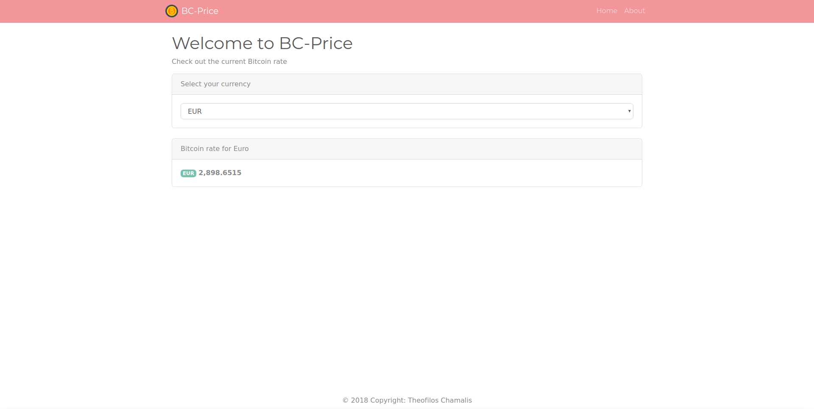

# BC-Price

> A simple Next.js web which presents the current Bitcoin value in USD, GBP and EUR

## Screenshots

<h3>Home Page</h3>


## Quick Start

``` bash
# Install dependencies
npm install

# Serve on localhost:3000
npm run dev

# Build for production
npm run build
```

### Author

[Theofilos Chamalis](http://cs.uoi.gr/~thchama)

### Version

1.0.1

### License

This project is licensed under the MIT License
